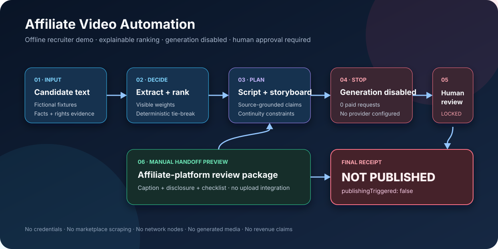

# Social Commerce Video Automation

An offline n8n demo that ranks fictional products, creates a supported
short-form video plan, and prepares a human-reviewed handoff without generating
or publishing content.

[](https://n8n.io/)
[](docs/demo-guide.md)
[](LICENSE)



## Review this project in 3 minutes

No setup is required:

1. Follow the diagram from fictional product details to the final handoff.
2. Read [How it works](#how-it-works) and
   [Important controls](#important-controls).
3. Open the [workflow](workflows/social-commerce-video-automation-demo.json),
   [architecture notes](docs/architecture.md), or
   [verification record](docs/verification.md) for more detail.

## The problem

Social-commerce content requires several different decisions: which product to
test, which facts are supported, whether supplied media can be used, what the
video should show, and whether a person has approved the result. Combining all
of those decisions inside one AI prompt makes the process difficult to review.

This workflow separates them into visible steps. Fixed rules select a product,
the content plan uses only reviewed facts, and the process stops before any paid
generation or publishing action.

## How it works

1. Load fictional product details that represent reviewed source data.
2. Convert the supplied text into consistent product fields.
3. Check that required facts and media rights are present.
4. Rank eligible products with visible scoring rules.
5. Build a hook, script, storyboard, and video brief from supported facts.
6. Stop before video generation and require human review.
7. Prepare a manual multi-platform handoff marked `NOT_PUBLISHED`.

## What this demonstrates

- Explainable product ranking instead of an AI-selected winner.
- Structured extraction from semi-formatted user input.
- Evidence and media-rights checks before creative work begins.
- Clear boundaries around paid model calls and publishing actions.
- A human approval step for facts, product fidelity, disclosure, and final
  media.
- A credential-free n8n workflow and offline test harness.

## Important controls

- **No marketplace scraping.** The demo reads only supplied fictional text.
- **Repeatable ranking.** The same inputs and scoring month produce the same
  order.
- **Supported claims only.** The script blocks unverified prices, guarantees,
  scarcity, and superlatives.
- **No paid generation.** The public adapter is disabled and records zero
  submitted requests.
- **No automatic publishing.** The final output is a review package, not a
  platform post.
- **Disclosure remains required.** A production reviewer must confirm current
  affiliate and synthetic-media disclosure requirements.

## Optional offline demo

The demo requires Node.js but no credentials, network access, marketplace
account, or model subscription.

```bash
npm test
```

The final output should show that one fictional candidate was selected, zero
paid generation requests were submitted, and publishing was not triggered.

To inspect the workflow in n8n:

1. Import
   [`workflows/social-commerce-video-automation-demo.json`](workflows/social-commerce-video-automation-demo.json)
   into n8n 2.x.
2. Open **Social Commerce Video Automation — Offline Recruiter Demo**.
3. Select **Execute workflow**.
4. Inspect **Output — NOT PUBLISHED**.

See the [demo guide](docs/demo-guide.md) for the complete walkthrough.

## Public demo boundary

The repository is a clean portfolio demonstration, not a production export. It
uses fictional products, sellers, metrics, links, and media references. It does
not retrieve current marketplace data, write to Google Sheets, generate video,
upload media, or publish to a platform.

A production version would need approved data access, attributable human
approval, current advertising and platform-policy checks, and monitored
generation and publishing integrations. Ranking scores would also need human
calibration against real outcomes; this demo does not claim that a score
predicts revenue.

## Project guide

- [Architecture and design decisions](docs/architecture.md)
- [Offline demo guide](docs/demo-guide.md)
- [Verification record](docs/verification.md)
- [Public/private boundary](docs/provenance.md)
- [Expected output](examples/expected-output.json)
- [Importable workflow](workflows/social-commerce-video-automation-demo.json)

## License and independence

This independent project is not affiliated with or endorsed by a marketplace,
social network, affiliate network, or video-generation provider.

Copyright © 2026 Mark Cruz. Released under the [MIT License](LICENSE).
