# Architecture and design decisions

## System flow

```mermaid
flowchart LR
    A[Fictional candidate text] --> B[Extract structured fields]
    B --> C[Evidence and rights gates]
    C --> D[Deterministic scoring]
    D --> E[Select one candidate]
    E --> F[Script and storyboard]
    F --> G[Generation adapter disabled]
    G --> H[Human review required]
    H --> I[Multi-platform handoff preview]
    I --> J[NOT PUBLISHED]
```

The public demo keeps one readable path. Each node adds one decision layer and forwards an auditable JSON payload.

## Candidate schema

The input simulates reviewed spreadsheet rows with these boundaries:

- `RawListingText` and `RawAffiliateMetrics` are supplied source text, not scraped content;
- `FactsVerified` indicates that a person checked the claims against the source;
- `RightsConfirmed` and `ImageRightsEvidence` gate later creative work;
- `CandidateId` is a stable key for ranking tie-breaks and future idempotent queue claims.

Extraction parses product name, category, price, commission rate, sales, rating, and review count. It does not infer unsupported values when a required field is absent.

## Scoring model

Eligible candidates receive a score from seven visible components:

| Component | Weight | Purpose |
| --- | ---: | --- |
| Commission economics | 25% | Approximate value of one conversion |
| Commuter fit | 20% | Relevance to the selected niche |
| Demand | 15% | Log-scaled sales signal |
| Video fit | 15% | Number of visually demonstrable features |
| Trust | 10% | Rating and review-depth signal |
| Angle depth | 10% | Breadth of useful content angles |
| Seasonality | 5% | Month-aware relevance |

Commission, demand, and review signals are capped or log-scaled so one extreme value cannot dominate the full score. A stable candidate ID resolves the final tie.

The score is a prioritization heuristic, not a revenue prediction. Production calibration requires actual impressions, clicks, orders, returns, commission, and content-level conversion data.

## Creative planning

The selected product moves through three transformations:

1. **Script:** a hook, verified proof, CTA, disclosure, and blocked-claim check.
2. **Storyboard:** one vertical eight-second shot with one camera move, restrained product action, continuity anchors, and forbidden changes.
3. **Provider brief:** a provider-neutral prompt and request shape marked `COMPILED_NOT_SUBMITTED`.

Text overlays, price, disclosure, and CTA are deliberately excluded from generative footage. In production they should be added deterministically after generation, using current verified values.

## Generation boundary

The public workflow has no network-capable generation node. **Video Generation Adapter — DISABLED** records:

- provider request status: `NOT_SUBMITTED`;
- paid generation requests: `0`;
- paid generation triggered: `false`;
- required production gates: budget approval, rights evidence, approved model, and human authorization.

This makes the disabled state executable and testable rather than relying on documentation alone.

## Human review and publishing boundary

The final media is intentionally absent. The human-review node therefore returns `REQUIRED_MANUAL_REVIEW` and `canPublish: false`.

A production approval should be attributable and should inspect:

- the actual rendered video;
- product and seller fidelity;
- current facts, price, and availability;
- affiliate and synthetic-media disclosures;
- source and music rights;
- platform-specific format and tagging;
- paid-request receipt and estimated cost.

The multi-platform node prepares only a configurable manual handoff preview. The last node always returns `NOT_PUBLISHED`.

## Production extension points

The safe production sequence is staged:

1. replace fictional fixtures with a reviewed Google Sheets adapter;
2. add a controlled write-back step for extraction status and rank;
3. add queue claiming with a stable key and compare-and-set semantics;
4. calibrate scores from real conversion outcomes;
5. add a paid generation adapter behind an explicit per-run budget authorization;
6. add media metadata and product-fidelity QA;
7. add an attributable approve/reject wait state;
8. keep platform posting manual until an approved network-specific publishing integration is available.

Each stage should be testable independently and should preserve the inactive, zero-cost default.
